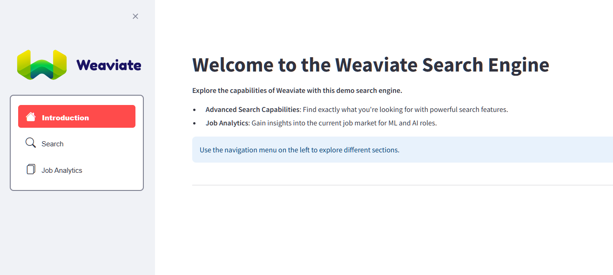
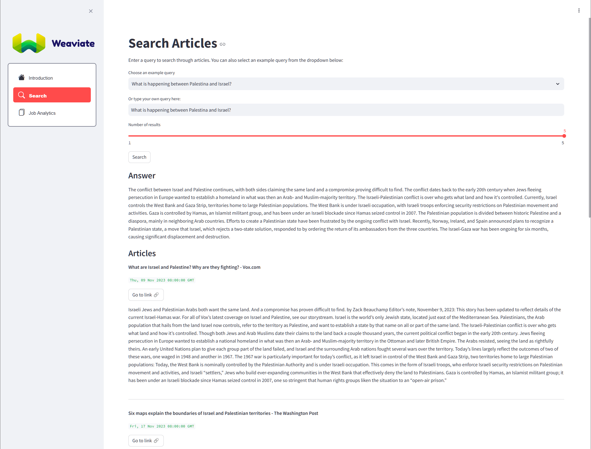
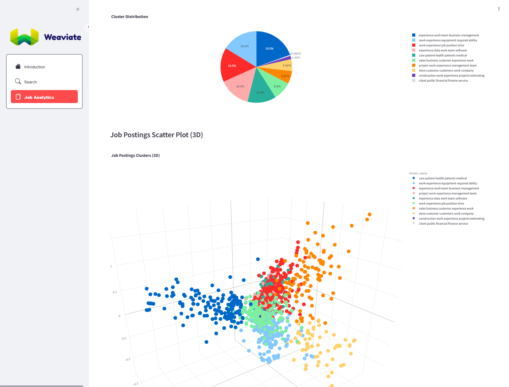

# Weaviate-ML Challenge Project

## Project Overview

This project is part of the Weaviate Machine Learning Engineer challenge. It demonstrates a workflow utilizing Weaviate to process, index, and search data, with a user-friendly frontend for interaction. Additionally, this project includes a job openings analytics component, showcasing my ability to handle both the UI and data modulation aspects of the challenge.

**You can access the frontend by clicking [here](https://3679-83-49-112-195.ngrok-free.app/).**

Be mindful of the usage, there are not many credits for the underlying LLM API when searching.

## Technologies Used

- Python 3.10
- Poetry
- Weaviate
- Streamlit (for UI)
- Docker

## Setup Instructions

### Prerequisites

- Python 3.10
- Poetry
- Docker

### Installation

1. [Install Poetry](https://python-poetry.org/docs/#installing-with-pipx).
2. Install Python 3.10 (recommended to use Pyenv).
3. Run `poetry shell` to create the Poetry environment.
4. Install packages with `poetry install --with dataset`.
5. **Optional**: Create the dataset with `python scripts/create_dataset.py`.
6. Copy `.env_samples` to `.env` and set the `OPENAI_APIKEY` that will be given to you in that `.env` file.
7. Start Weaviate with `docker-compose up -d`.
8. Index data with `python scripts/index.py`.
9. Run the frontend with `python -m streamlit run app.py`.
10. Explore the UI.

## Project Structure

- **.env**, **.env_samples**: Environment configuration.
- **app.py**: Main application file for Streamlit frontend.
- **docker-compose.yml**: Docker configuration for Weaviate.
- **data/**: Contains datasets.
- **scripts/**: Various scripts for data processing, indexing, and searching.
- **src/**: Source code, including clustering, dataset handling, frontend, and Weaviate ML scripts.

## Data Pipeline

Data is fetched, processed, and indexed into Weaviate. The frontend allows users to search and analyze the indexed data.

## Key Features

- Efficient data processing and indexing.
- User-friendly Streamlit interface for interaction.
- Integration with Weaviate for robust search capabilities.
- Comprehensive job openings analytics component.

## UI Screenshots

### Home Page

### Search Page

### Job Analytics Page

## Future Improvements

- More complex search capabilities: Reranker, query expansion, filters, etc.
- More comprehensive job openings analytics component. I didn't dig much into this part of the challenge because of time, so I just did a naive implementation and a frontend component.
- Production ready search engine: tests, CI/CD, Cloud infrastructure, etc.

## Conclusion

This project demonstrates my ability to build and integrate a data science workflow using Weaviate. It highlights my skills in data processing, machine learning, frontend development (even though it's Python 😁), and job openings analytics, covering both paths in the challenge.

## Personal Note

This project didn't take an extensive amount of effort because I leveraged pieces from past projects. I genuinely enjoyed working on this challenge, which motivated me to do so much. It was a great opportunity to apply and showcase my skills in a meaningful way.
